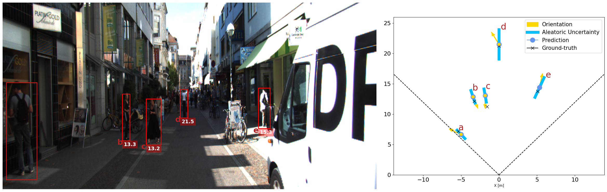
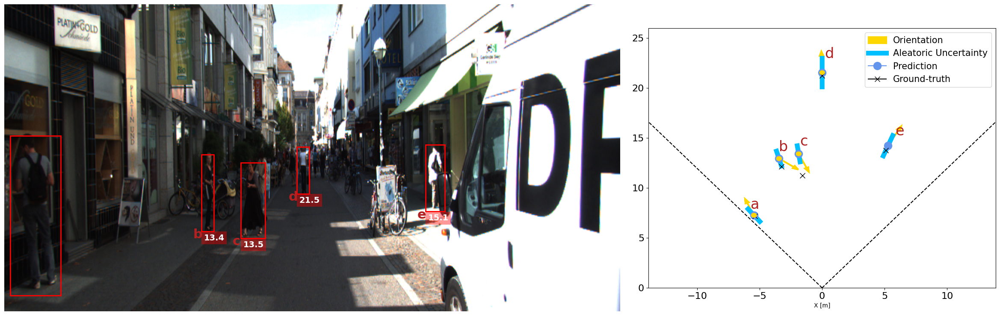
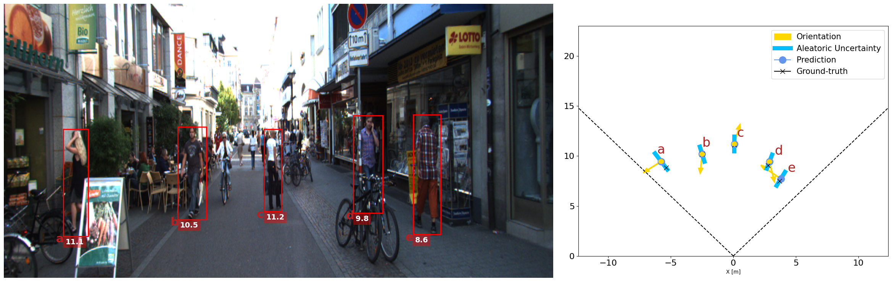

# Project Information: Enhancing MonoLoco with Transformers

This project is a fork of the original repository [vita-epfl/monoloco](https://github.com/vita-epfl/monoloco). It builds upon the existing work to enhance the accuracy and computational efficiency of the MonoLoco model by incorporating transformer networks.

For detailed information about the original project and its functionalities, please refer to the [vita-epfl/monoloco](https://github.com/vita-epfl/monoloco) repository or the `monolocoREADME.md` file.

If you have any additional questions or require further information, please consult the aforementioned repository or the `monolocoREADME.md` file for detailed instructions and explanations.

## Our contribution

Our contribution aims to enhance the accuracy and computational efficiency of the MonoLoco model by incorporating transformer layers. We have made several changes to the existing work to achieve these improvements.

We aimed to improve the accuracy of the Skeleton-based Human 3D Localization problem by implementing a transformer network in the `architectures.py` file. The point of using transformers was to help the model predict faster and with more accuracy by using self attention and focus on the most relevant elements.
We modified the architecture in various ways, and the architecture presented below is the most reliable model we implemented.

<div align="center">
    <figure>
        <figcaption>Architecture of the MonoLoco model enhanced by our contribution</figcaption>
        
    </figure>
</div>

The improved model used to compute the weights that can be found in the `weights` folder.

Below are the results of our experiments with different transformer placements:

1. *After Preprocessing FC Layer:* When the transformer layer was added after the preprocessing fully connected (FC) layer, the training accuracy reached approximately 50%.
2. *Replacing Preprocessing FC Layer:* By replacing the preprocessing FC layer with a transformer layer, we observed an improvement in accuracy, achieving 60%.
3. *After Linear Stages of FC Layers:* Adding the transformer layer after the linear stages of FC layers resulted in a drop in accuracy to 30%. This approach was inconclusive.
4. *Replacing FC Layers with Transformer Layers:* Our best implementation involved replacing the FC layers in the linear stages with transformer layers. This modification allowed us to leverage self-attention, the critical aspect of the architecture. With this approach, we achieved an accuracy of 83.7%.

Throughout our experimentation, we explored a total of 96 different architectures, fine-tuning each one to achieve the best possible accuracy.

## Experimental Setup and Evaluation Metrics

We conducted a series of experiments to evaluate the effectiveness of the transformer-based enhancements. The evaluation metrics used to measure the performance were:

- Training Accuracy: The accuracy achieved during the training phase.
- Validation Accuracy: the accuracy achieved during the validation phase. This was automatically implemented by MonoLoco.

## Dataset Description

To train our model, we utilized the dataset used by the MonoLoco model: KITI dataset. The dataset contains 21,797 images of pedestrians in various poses. The dataset is split into 11,530 training images and 10,267 test images. The images are annotated with 3D bounding boxes and 2D keypoints. The dataset also contains the camera calibration matrices for each image.

To acquire the dataset, please refer to the original MonoLoco documentation for instructions on obtaining the data in the required format.

This dataset will go through the `openpifpaf` prediction pipeline, which will generate the 2D keypoints. The generated data will then be used to train the model.

## Running the Code

To run the code and make predictions using our trained model, follow these steps:

### Setting up the Project

1. Create a virtual environment with Python 3.9.9 installed:

``` bash
python3 -m venv myenv
```

2. Clone the project repository from GitHub:

``` bash
git clone https://github.com/VicenteTM/DLAV-2023_Project.git
```


or 

``` bash
git clone https://github.com/vita-student-projects/Group39_Skeleton-based-Human-3D-Localization.git
```


3. Navigate to the project directory:

``` bash
cd DLAV-2023_Project
```


4. Install the project dependencies:

``` bash
pip3 install sdist wheel
python3 setup.py sdist bdist_wheel
pip3 install -e .
```


### Fixing Errors

If you face yourself with an error in the openpifpaf library, please change the 'if' statement in the 'openpifpaf/network/factory.py' file to the following:

``` python
if hasattr(torchvision.models.mobilenetv2, 'ConvBNReLU') \
   and not hasattr(torchvision.models.mobilenet, 'ConvBNReLU'):
```

### Modifying Torch Version

Change the version of Torch by running the following command:

``` bash
pip3 install torch==1.13.1+cu117 torchvision==0.14.1+cu117 torchaudio --index-url https://download.pytorch.org/whl/cu117
```


### Running the Code

``` bash
python3 -m monoloco.run predict <desired_image_path> --model final_weights.pkl
```


## Results

Our best training accuracy with the enhanced model was an average distance of 0.89 with a bird's eye view distance of 1.33, resulting in an accuracy of 83.7%.

### Comparison with the Original Model

The following 4 images are the output of the original MonoLoco model compared to our model on 2 images taken from the docs folder of MonoLoco. 

<div align="center">
    <figure>
        <figcaption>Our model of the image 000840.png from the KITI dataset</figcaption>
        
    </figure>
    <figure>
        <figcaption>Monoloco's model of the image 000840.png from the KITI dataset</figcaption>
        
    </figure>
</div>

<div align="center">
    <figure>
        <figcaption>Our model of the image 002282.png from the KITI dataset</figcaption>
        
    </figure>
    <figure>
        <figcaption>Monoloco's model of the image 002282.png from the KITI dataset</figcaption>
        
    </figure>
</div>

From the predictions we can notice that the accuracy of our model is as good and on some predictions better than MonoLoco, but the most important element is that the computational time of our model is faster by a few hundred ms, thus proving that our model has contributed in terms of computational efficiency. One issue with our model is that the uncertainty has increased compared to MonoLoco.
We were not able obtain quantitative result as we didn't have access to the annotations used by MonoLoco which obtained the annotations directly from the authors and didn't have yet the permission to publish them.


## Conclusion

The incorporation of transformers into the MonoLoco model has shown significant potential for improving human 3D localization. However, to achieve a computationally efficient model, it is crucial to reduce the complexity of the transformers while maintaining precision and real-time performance.

Should you have any additional questions or require further information, please feel free to reach out.